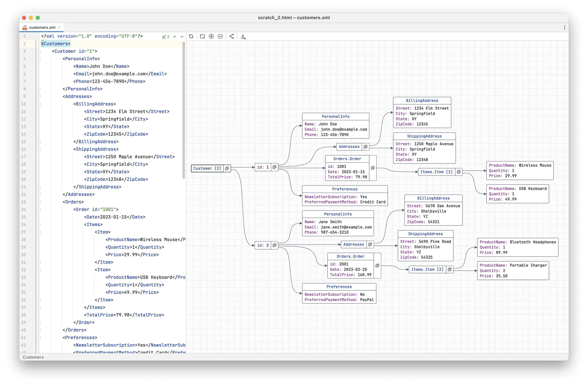
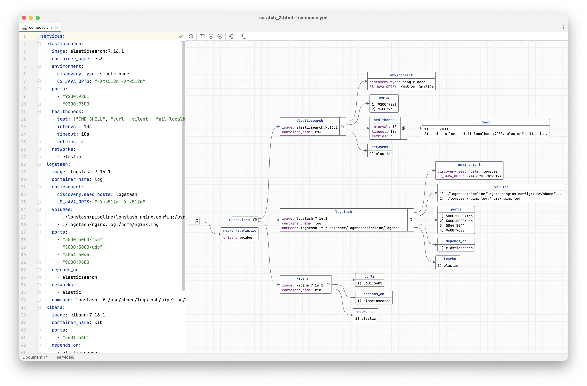
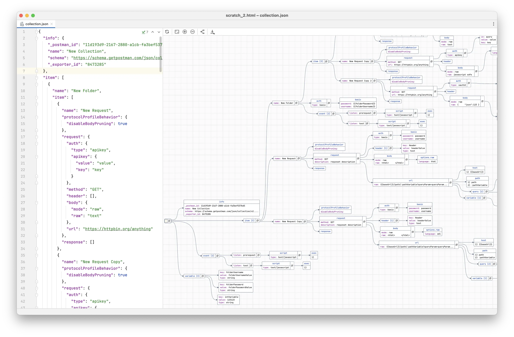

DataGraph Plugin for JetBrains IDEs
===

The [DataGraph](https://plugins.jetbrains.com/plugin/22472-datagraph--json-yaml-xml-visualization) plugin visualizes JSON, YAML, and XML in interactive graphs, providing a powerful tool for exploring large and complex data structures.

Here's what you can do with DataGraph:
- Explore and interact with data in a graph view, supporting JSON, YAML, XML, TOML, and Properties files
- Seamlessly navigate between the graph and the corresponding location in the editor, and vice versa
- Collapse and expand nodes in the graph, with synced functionality in the editor
- Export the graph to a PNG or SVG file

Inspired by the JsonCrack tool, DataGraph offers additional advantages, including tight integration with the editor and the ability to work locally without sending data to a server, making it safe to use with sensitive data.

